```{r setup, include=FALSE}
options(htmltools.dir.version = FALSE)
knitr::opts_chunk$set(
  fig.width=9, fig.height=3.5, fig.retina=3,
  out.width = "100%",
  cache = FALSE,
  echo = FALSE,
  message = FALSE, 
  warning = FALSE,
  hiline = TRUE
)

library(tidyverse)
library(gt)
library(knitr)
library(fontawesome)
```

```{r xaringan-themer, include=FALSE, warning=FALSE}
library(xaringanthemer)
style_mono_accent(
 base_color = "#8bb8e8",
  black_color = "#005587",
  header_color = "#2774AE",
  text_bold_color = "#ffb81c",
  table_row_even_background_color = "#FFFFFF",
  title_slide_text_color = "#2774AE",
  table_border_color = "#8bb8e8",
 text_font_size = "22px")

```

background-image: url(./figs/logo.png)
background-position: 5% 95%
background-size: 35%
class: center, middle

# Target trial emulation in dementia research

.pull.right[

L. Paloma Rojas-Saunero MD, PhD
<br>
Postdoctoral scholar
<br>
**Dr. Mayeda's group, Department of Epidemiology**

]

---

### Dementia under a causal inference lens

<br>

.center[ 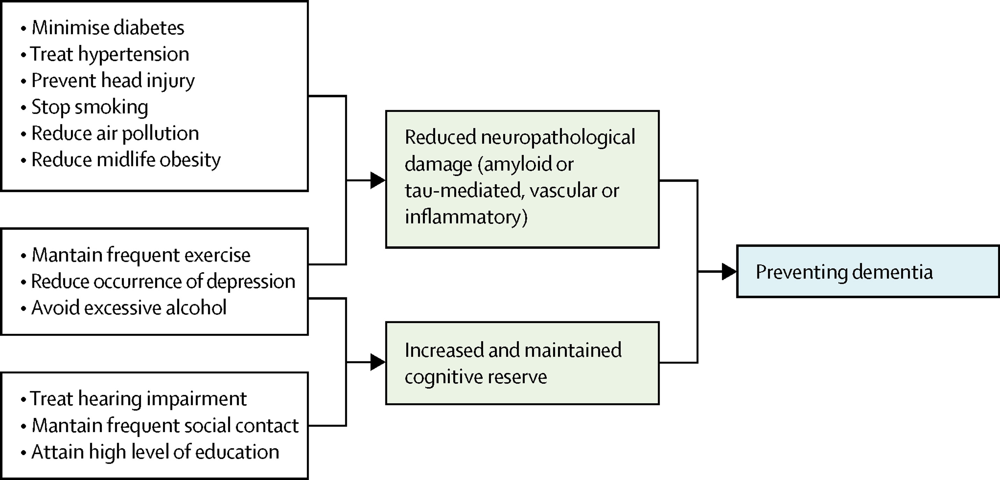 ]


.footnote[
2020 report of the Lancet Commission]

---

### Randomized trials

Experiment in which participants are randomly assigned to follow specified treatment strategies.

--

**Ideal randomized trial**:

   + No loss to follow-up

   + Full adherence through out the study duration

   + Double blind assignment

--

Usually they following time points are aligned by design:

- Eligibility criteria

- Treatment assignment (randomization)

- Follow-up starts

???
Counterfactual or potential outcomes, Causal diagrams (e.g., DAGs, SWIGs)
The concept of an “ideal randomized trial” is tied directly to these languages

---
.center[

**Association is causation!**

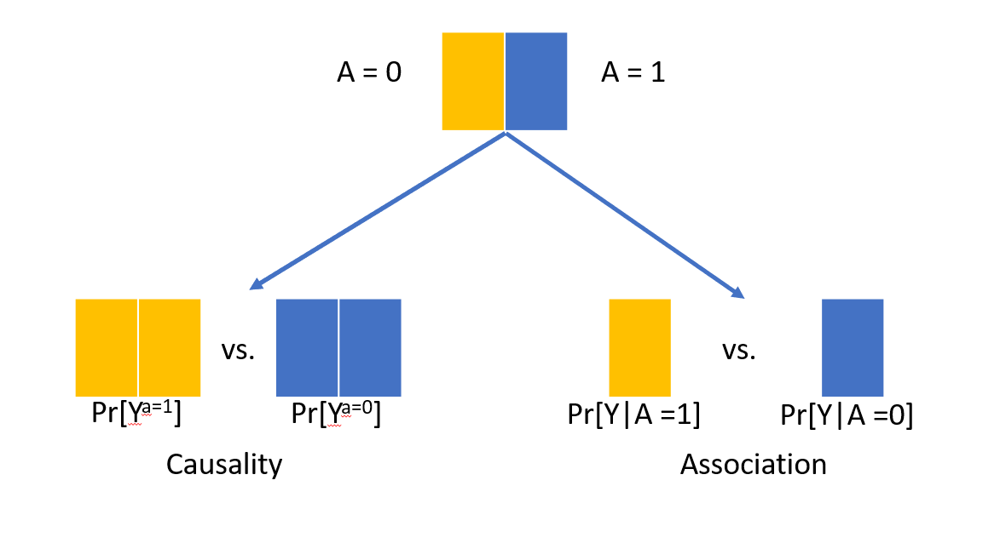

]

.footnote[**Hernán MA, Robins JM (2020). Causal Inference: What If**]

???
Under this design, comparing the observed average outcomes under each treatment arm is the same as comparing what would have happened had everybody been in one treatment arm versus the other

---
## Target trial emulation
--

- Conceptualize the hypothetical randomized trial we would like to conduct that answers our question

--

- Describe the protocol elements of that target trial

--

- Emulate the target trial with observational data as close as possible

---
class: center, middle

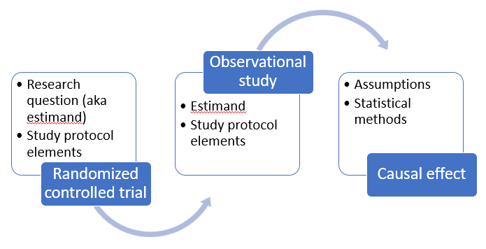

---

class: middle, center


???
Now, you may feel skeptical about this framework if you are not working specifically in pharmacoepi. Most of the modifiable risk factors are not easy to conceptualize as treatment arms in a trial. 
I hope my work here helps moving out from that dilemma and using the core concepts of this framework to improve the way ask questions and seek responses with observational studies.

But first, lets start with a case where we are actually interested in repurposing a drug for dementia prevention. 

---
class: middle, right

## Emulating a target trial of statin use and risk of dementia using cohort data

<br><br>

Ellen C. Caniglia, L. Paloma Rojas-Saunero,  Saima Hilal, Silvan Licher, Roger Logan, Bruno Stricker, M. Arfan Ikram, Sonja A. Swanson

_Neurology. 2020_

---
class: center, middle


.left[

.footnote[Edouard L. Fu et al. Clinical Kidney Journal. 2020]
]

???

Frequently, observational studies that don't conceptualize the target trial self inflict with bias due to time-zero missalignment, or other sources of bias

---
class: even_smaller

```{r}
target_statins <-
  tibble::tribble(
    ~ "<b> Section </b>",
    ~ "<b> Target trial protocol </b>",
    ~ "<b> Emulation using observational data </b>",
    "<b> Eligibility criteria </b>",
    "Age 55 - 80 years, no statin prescription in the previous 2 years, known to be dementia free, MMSE >=26; cholesterol, BMI and SBP measurement",
    "Same, except MMSE which is measured within the previous 3 years",
    "<b> Treatment strategies  </b>",
    "1. Initiate statin therapy at baseline and remain on it during the follow-up unless serious illnes occurs <br>
     2. Refrain from taking statin therapy during the follow-up unless serious illness occurs",
    "Same",
    "<b> Randomized assignment </b>",
    "Random assignment to either strategy at baseline",
    "Random assignment at baseline within levels of sex, educational attainment, age, calendar year, smoking status, MMSE, BMI, APOE4 status, cardiovascular covariates",
    "<b> Start/End of follow-up </b>",
    "From baseline until dementia dx, death, or loss to follow-up (10 years without an MMSE measurement), or January 1st, 2015, which ever happened first",
    "Same",
    "<b> Outcome  </b>",
    "Dementia (Death as a censoring event) <b>",
    "Same",
    "<b> Causal contrast  </b>",
    "Intention-to-treat <br>
    Per-protocol effect",
    "Same") %>% mutate(n = row_number())


target_statins %>% filter(n %in% c(1)) %>% select(-n) %>% gt() %>% 
   cols_width(
    "<b> Section </b>" ~ px(120),
    "<b> Target trial protocol </b>" ~ px(320),
    "<b> Emulation using observational data </b>" ~ px(320))
     
```

---
class: even_smaller

```{r}
target_statins %>% filter(n %in% c(1:2)) %>% select(-n) %>% gt()  %>% 
   cols_width(
    "<b> Section </b>" ~ px(120),
    "<b> Target trial protocol </b>" ~ px(320),
    "<b> Emulation using observational data </b>" ~ px(320))
```

---
class: even_smaller

```{r}
target_statins %>% filter(n %in% c(1:3)) %>% select(-n) %>% gt()  %>% 
   cols_width(
    "<b> Section </b>" ~ px(120),
    "<b> Target trial protocol </b>" ~ px(320),
    "<b> Emulation using observational data </b>" ~ px(320)) 
```

---
class: even_smaller

```{r}
target_statins %>% filter(n %in% c(1:4)) %>% select(-n) %>% gt()  %>% 
   cols_width(
    "<b> Section </b>" ~ px(120),
    "<b> Target trial protocol </b>" ~ px(320),
    "<b> Emulation using observational data </b>" ~ px(320))
```

---
class: even_smaller

```{r}
target_statins %>% filter(n %in% c(1:5)) %>% select(-n) %>% gt()  %>% 
   cols_width(
    "<b> Section </b>" ~ px(120),
    "<b> Target trial protocol </b>" ~ px(320),
    "<b> Emulation using observational data </b>" ~ px(320))
```

---
class: even_smaller

```{r}
target_statins %>% filter(n %in% c(1:6)) %>% select(-n) %>% gt()  %>% 
   cols_width(
    "<b> Section </b>" ~ px(120),
    "<b> Target trial protocol </b>" ~ px(320),
    "<b> Emulation using observational data </b>" ~ px(320))
```

---
### Rotterdam study

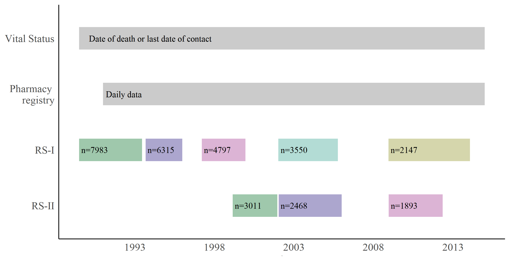
???

RS is a population-based cohort that recruited participants living in the district of Ommoord, in Rotterdam, the Netherlands. The cohort was recruited from all inhabitants aged 55 years and older. Participants were invited in random clusters, through sampling from the municipal registerfull recruitment and complete data acquisition started in January, 1990.
In 1999, members of Ommoord who had become 55 years of age or moved into the study district since the recruitment were invited to participate; out of 4472 invitees, 3011 new participants were included to the Rotterdam Study[@hofman2007] between February 1999 and December

---
### Methods

- New user design, using nested trials

--

- Inverse probability treatment weights

--

- Pooled logistic regression as a parametric alternative for time to event analysis

--

- Death as a censoring event (IPCW for exchangeability)

--

- Software: SAS _Initiators macro_*

.footnote[*https://causalab.sph.harvard.edu/software/]

---
### Intention to treat (Q1) vs. <br> per protocol effect (Q2)


.center[

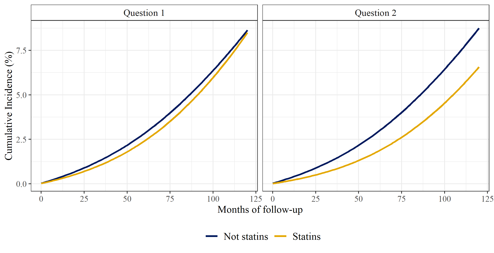
]

**10 year-dementia risk difference:** <br> -0.1% (-2.3%, 1.8%) vs -2.2% (-5.2%, 1.6%)

---
### Discussion

- Our findings suggest a potential decreased risk of dementia and dementia or death after sustained statin use compared with no statin use (the per-protocol analysis analogue).

--

- A per-protocol effect with more clinically-relevant discontinuation rules would be more insightful.

--

- There is still potential confounding by indication (at baseline and time-varying) and differential measurement error in dementia diagnosis.


---
class: middle, right

## Hypothetical blood-pressure-lowering interventions and risk of stroke and dementia

<br><br>

L. Paloma Rojas-Saunero, Saima Hilal, Eleanor Murray, Roger Logan, M. Arfan Ikram, Sonja A. Swanson

_European Journal of Epidemiology. 2021_

---

class:: smaller

```{r}
target_ht <-
  tibble::tribble(
    ~ "<b> Section </b>",
    ~ "<b> Target trial protocol </b>",
    ~ "<b> Emulation using observational data </b>",
    "<b> Eligibility criteria </b>",
    "< 80 years old, no cognitive impairment, no history of stroke, dementia diagnosis and other related diseases.",
    "Same + MMSE above 26 at baseline",
    "<b> Treatment strategies  </b>",
    "0. Natural course (comparison arm) <br>
    1. Keep SBP < 120 mmHg <br>
    2. Keep SBP < 140 mmHg <br>
    3. Reduce SBP by 20% if >140 mmHg <br>
    4. Quit smoking <br>
    5. Joint 3 + 4",
    "Same",
    "<b> Follow-up </b>",
    "From year of first visit until 15 years of follow-up, or year of stroke/dementia or death, which ever happened first",
    "Same + visit process simulation",
    "<b> Outcome  </b>",
    "Stroke and Dementia (Death as a competing event)",
    "Same",
    "<b> Causal contrast  </b>",
    "What would have been observed if all individuals adhered to their assigned strategy over 15 years and death is not eliminated(Total per protocol effect)",
    "Same") %>% mutate(n = row_number())
target_ht %>% select(-n) %>% gt() %>% 
     cols_width(
    "<b> Section </b>" ~ px(120),
    "<b> Target trial protocol </b>" ~ px(320),
    "<b> Emulation using observational data </b>" ~ px(320))
```


---

### Statistical analysis

.center[**_What would have happened had everyone was randomized and had adhered to each intervention (g)?_**]

Parametric G-formula: Allows presence of time-varying confounding feedback

--

.pull-left[]

--

.pull-right[]

--

.footnote[
<br><br>
**A** = SBP, **L** = _Fixed covariates_: age, sex, education, SBP, history of diabetes and heart disease. _Time-varying covariates_: visit process, smoking status, SBP, BMI, HT medication, total cholesterol and diagnosis of diabetes, heart disease, Parkinson disease, Parkinsonism, TIA, dementia or cancer, **Y** = Stroke / Dementia]

---
### Methods

1. Model each variable (A, L, Y, D) using the covariate history.

--

2. Select a random sample of baseline data and simulate covariate and treatment history using estimated coefficients from step 1.

--

3. Intervene by assigning the treatment value at each time point according to the hypothetical intervention.

--

4. Estimate the predicted probability of the outcome based on the updated intervention.

--

5. Calculate the average of the subject-specific risks and bootstrap CI.

--

6. Repeat steps 2-5 for each hypothetical intervention.


.footnote[

A (exposure), L (confounders), Y (outcome), D (competing event)
<br>
R package `gfoRmula`

]

---
### Results: Stroke

.center[

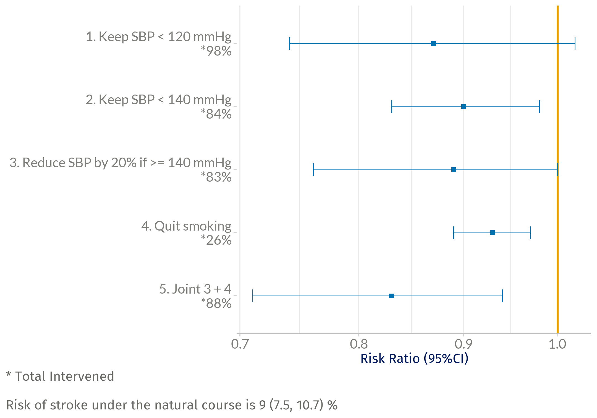

]

---
### Results: Stroke and death

.center[

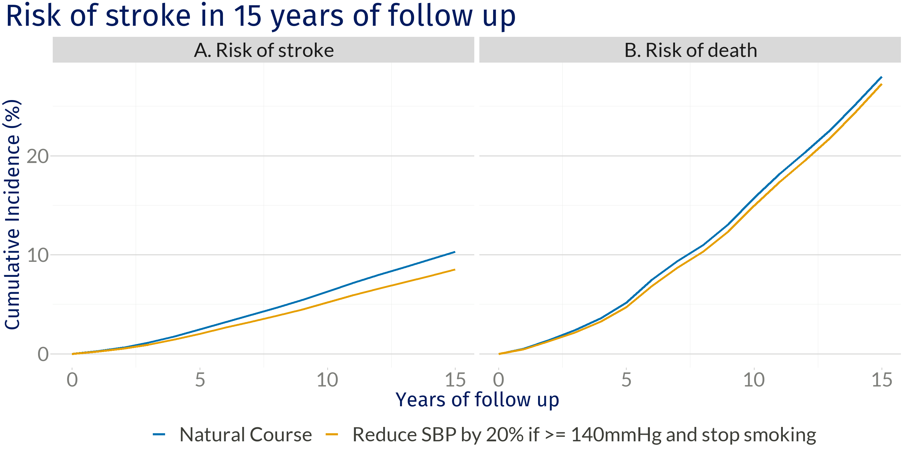
]

---
### Results: Dementia

.center[

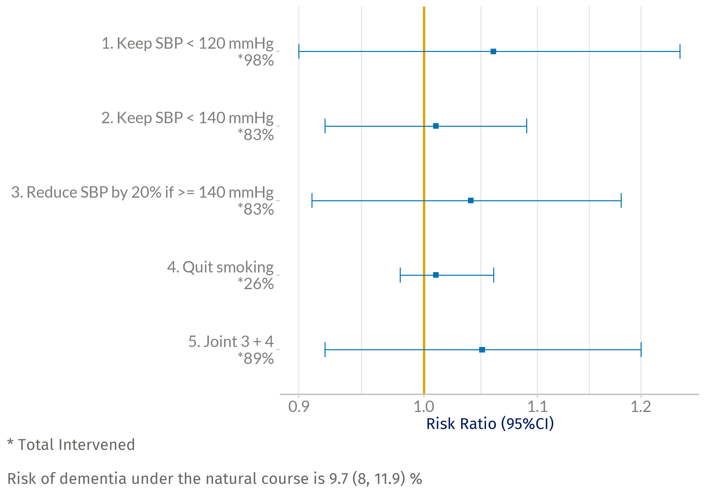
]

---
### Results: Dementia and death

.center[ 

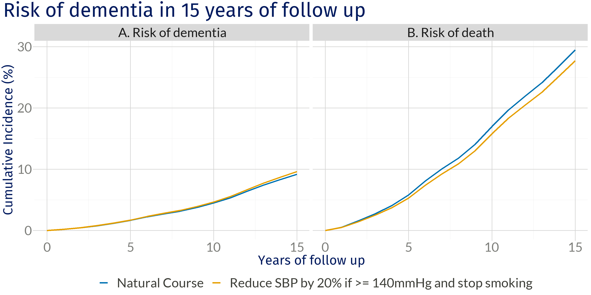

]

---

### Discussion

- Lowering blood pressure and quitting smoking reduces the risk of stroke, as described previously in literature.

--

- We did not observe the same effect in dementia, though the effect may be mediated on how interventions decrease the risk of death.

--

Estimates rely on important assumptions:

  + Time-varying data was sufficient

  + No modeling misspecification (consider data generation process)

---

## Related research

#### Towards a clearer causal question underlying the association between cancer and dementia
_Under review for Epidemiology_

--

#### Considering questions before methods in dementia research with competing events 
_American Journal of Epidemiology. In press._

--

#### Racial and ethnic differences in the risk of dementia under hypothetical blood‐pressure‐lowering interventions: The Multi-Ethnic Study of Atherosclerosis
_Work in progress_

---

## Preliminary results


---
class:center, middle

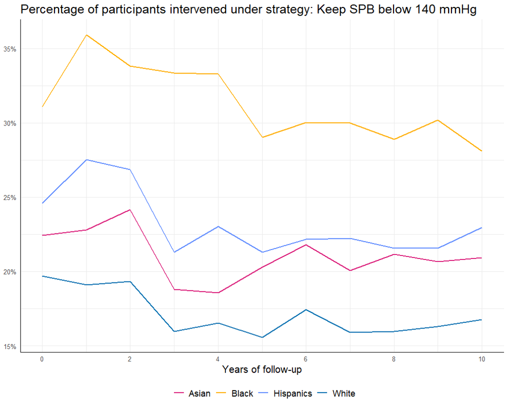

---
class:center, middle

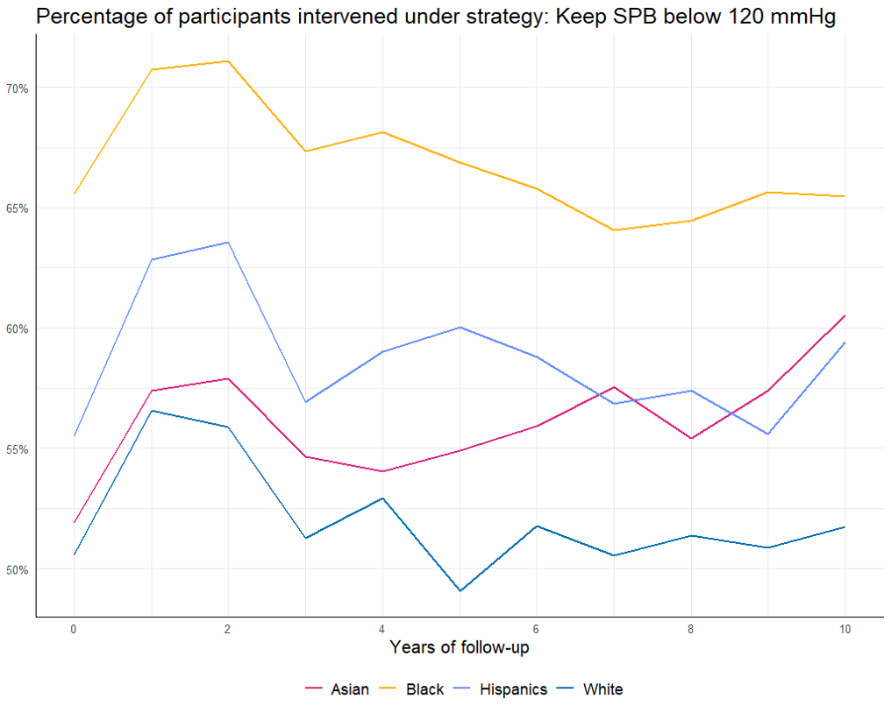
---

### Current challenges

<br>

- Differential missclasification of dementia, QBA?

--

- Modelling challenges for Chinese Americans.

--

- Intervention is limited to a shorter length of time than the outcome.

---

### A note on well-defined interventions

<br><br>

- There is a long standing debate on what classifies as "well-defined" or "ill-defined".

--

- In the studies of lowering blood pressure we did not specified how SBP would be lowered, this represents a weighted average of strategies, determined by the frequency of these in the studied population.

--

- The target trial framework helps us in being more transparent about our questions, assumptions and interpretations.

--

- This POV can help us study social determinants in new ways.

---

## Take aways


- Having a clear question (or estimand) is key to conceptualize the best study design that answers it. 
  
--

- We can use the target trial framework even if we don’t have the intervention of interested measured (or discovered).

--

- Specifying the components of the target trial should be one of the first steps prior to the outline of an analysis plan that emulates such trial. 

--

- We can prevent several sources of bias from having a better design, and we can identify other sources of bias that can prevented (or quantified) through the analytic strategies.

--

- It is a dynamic process, since it requires a deep understanding of the data sources and a constant check that the causal contrasts and subsequent results are informative. 

---

class: center, middle


---
class: center, middle

### Thank you, Gracias!

`r fa("paper-plane")`</i>&nbsp;lp.rojassaunero@ucla.edu</a><br>

`r fa("twitter")` <a href="http://twitter.com/palolili23"> </i>&nbsp; @palolili23</a><br>

`r fa("github")` <a href="https://github.com/palolili23"> </i>&nbsp; @palolili23</a><br>